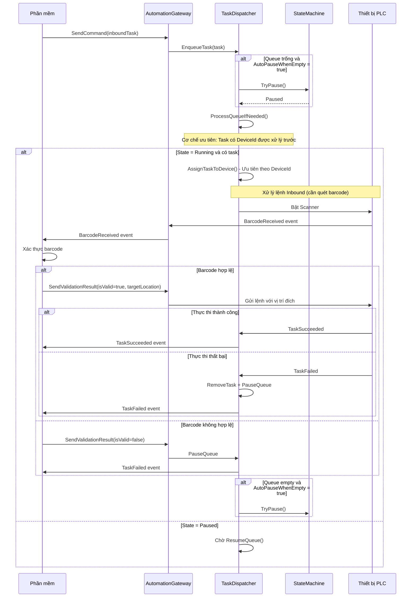
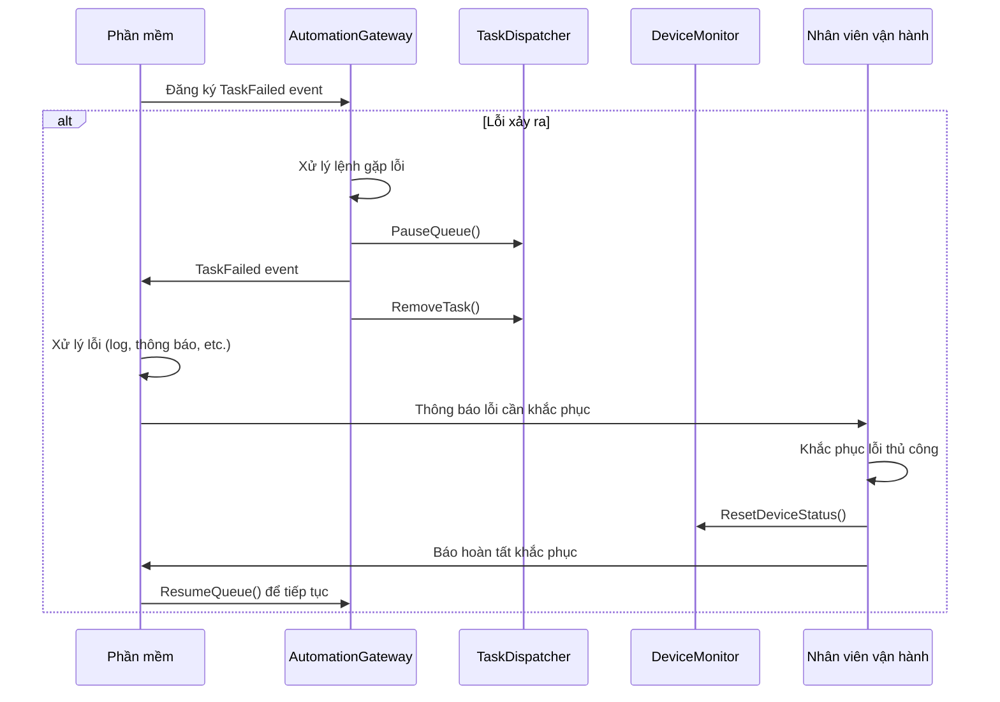

# TQG Automation SDK# TQG Automation SDK


## Tổng quan## Tổng quan


TQG Automation SDK là giải pháp tích hợp cho hệ thống tự động hóa kho bãi, quản lý và điều khiển thiết bị PLC (Shuttle) thông qua API đơn giản.TQG Automation SDK cung cấp giải pháp tích hợp hoàn chỉnh cho hệ thống tự động hóa kho bãi, hỗ trợ quản lý và điều khiển các thiết bị PLC (Shuttle) thông qua giao diện lập trình đơn giản và hiện đại.


### Tính năng chính### Tính năng chính


- **Singleton Pattern**: Gateway duy nhất thread-safe cho toàn ứng dụng- **Singleton Pattern**: Gateway duy nhất cho toàn bộ ứng dụng, đảm bảo thread-safe

- **Command Orchestration**: Điều phối lệnh thông minh với matchmaking tự động- **Command Orchestration**: Hệ thống điều phối lệnh thông minh với matchmaking tự động

- **Device Management**: Quản lý đa thiết bị với giám sát real-time- **Device Management**: Quản lý đa thiết bị với giám sát trạng thái real-time

- **Barcode Validation**: Xác thực mã vạch với timeout tự động (5 phút)- **Barcode Validation**: Tích hợp quy trình quét và xác thực mã vạch với timeout tự động

- **Warehouse Layout**: Validation vị trí kho với cấu hình block depth- **Warehouse Layout**: Validation vị trí kho với cấu hình block depth và disabled positions

- **Event-Driven**: Architecture dựa trên Channel communication- **Event-Driven**: Architecture dựa trên sự kiện với Channel-based communication

- **Mode Switching**: Chuyển đổi Real PLC ↔ Emulated mode- **Mode Switching**: Hỗ trợ chuyển đổi giữa Real PLC và Emulated mode

- **Exception Handling**: Xử lý lỗi toàn diện với custom exceptions- **Exception Handling**: Xử lý lỗi toàn diện với custom exception types


**Target Framework:** .NET 8.0**Namespace:** `TQG.Automation.SDK`  

**Assembly:** TQG.Automation.SDK  

---**Target Framework:** .NET 8.0


## Quick Start## Cấu trúc API


### 1. Khởi tạo Gateway### AutomationGateway (Singleton)


```csharpĐiểm truy cập chính để tương tác với các thiết bị PLC. Sử dụng Singleton pattern để đảm bảo chỉ có một instance duy nhất trong toàn bộ ứng dụng.

using TQG.Automation.SDK;

using TQG.Automation.SDK.Shared;#### Khởi tạo


// Đọc cấu hình từ JSON```csharp

string configJson = File.ReadAllText("plc-config.json");// Cách 1: Khởi tạo từ danh sách PlcConnectionOptions

AutomationGateway.Instance.Initialize(configJson);var configurations = new List<PlcConnectionOptions>

{

// Load warehouse layout    new PlcConnectionOptions

string layoutJson = File.ReadAllText("warehouse-layout.json");    {

AutomationGateway.Instance.LoadWarehouseLayout(layoutJson);        DeviceId = "Shuttle01",

        IpAddress = "192.168.1.100",

// Đăng ký events        Port = 102,

var gateway = AutomationGateway.Instance;        Mode = PlcMode.Real, // hoặc PlcMode.Emulated

gateway.TaskSucceeded += OnTaskSucceeded;        Capabilities = DeviceCapabilities.All,

gateway.TaskFailed += OnTaskFailed;        SignalMap = new SignalMap { /* ... */ }

gateway.TaskAlarm += OnTaskAlarm;    }

gateway.BarcodeReceived += OnBarcodeReceived;};

```

AutomationGateway.Instance.Initialize(configurations);

### 2. Kích hoạt devices

// Cách 2: Khởi tạo từ JSON string

```csharpstring jsonConfig = File.ReadAllText("plc-config.json");

// Kích hoạt một deviceAutomationGateway.Instance.Initialize(jsonConfig);

await gateway.ActivateDevice("Shuttle01");

// Load warehouse layout

// Hoặc kích hoạt tất cảstring layoutJson = File.ReadAllText("warehouse-layout.json");

bool allActivated = await gateway.ActivateAllDevicesAsync();AutomationGateway.Instance.LoadWarehouseLayout(layoutJson);

``````


### 3. Gửi lệnh**Exceptions:**

- `ArgumentNullException`: Khi configurations null

```csharp- `ArgumentException`: Khi configurations empty hoặc có duplicate device IDs

// Lệnh INBOUND (nhập kho - cần barcode validation)- `PlcConnectionFailedException`: Khi khởi tạo device thất bại

var inbound = new TransportTask- `ObjectDisposedException`: Khi gateway đã disposed

{

    TaskId = "IN_001",#### Properties

    DeviceId = "Shuttle01", // Optional - để null nếu auto-assign

    CommandType = CommandType.Inbound,| Property | Type | Mô tả |

    GateNumber = 1|----------|------|-------|

};| `Instance` | `AutomationGateway` | Singleton instance (static) |

| `IsInitialized` | `bool` | Gateway đã được initialize chưa |

// Lệnh OUTBOUND (xuất kho)| `DeviceCount` | `int` | Số lượng devices đã đăng ký |

var outbound = new TransportTask| `DeviceIds` | `IEnumerable<string>` | Danh sách device IDs |

{| `IsPauseQueue` | `bool` | Queue có đang pause không |

    TaskId = "OUT_001",

    CommandType = CommandType.Outbound,#### Events

    SourceLocation = new Location(1, 2, 3, 1), // Floor, Rail, Block, Depth

    GateNumber = 2,| Event | EventArgs Type | Mô tả |

    OutDirBlock = Direction.Bottom|-------|----------------|-------|

};| `TaskSucceeded` | `TaskSucceededEventArgs` | Task hoàn thành thành công |

| `TaskFailed` | `TaskFailedEventArgs` | Task thất bại |

// Lệnh TRANSFER (chuyển kho)| `TaskAlarm` | `TaskAlarmEventArgs` | Phát hiện alarm trong quá trình thực thi |

var transfer = new TransportTask| `BarcodeReceived` | `BarcodeReceivedEventArgs` | Nhận được barcode cần validation (INBOUND only) |

{

    TaskId = "TF_001",## API Methods

    CommandType = CommandType.Transfer,

    SourceLocation = new Location(1, 2, 3, 1),### Quản lý Warehouse Layout

    TargetLocation = new Location(1, 5, 3, 1),

    InDirBlock = Direction.Bottom,#### `void LoadWarehouseLayout(string layoutJson)`

    OutDirBlock = Direction.Top

};Load cấu hình warehouse layout từ JSON string. Định nghĩa các vị trí hợp lệ, giới hạn depth cho mỗi block, và các vị trí bị vô hiệu hóa.


// Gửi nhiều lệnh**Parameters:**

var result = await gateway.SendMultipleCommands(new[] { inbound, outbound, transfer });- `layoutJson`: Chuỗi JSON chứa cấu hình warehouse layout

Console.WriteLine($"Submitted: {result.Submitted}, Rejected: {result.Rejected}");

```**Exceptions:**

- `ArgumentNullException`: Khi layoutJson null hoặc empty

### 4. Xử lý Barcode (INBOUND only)- `ArgumentException`: Khi JSON invalid hoặc validation fails


```csharp```csharp

private async void OnBarcodeReceived(object? sender, BarcodeReceivedEventArgs e)string layoutJson = File.ReadAllText("warehouse-layout.json");

{AutomationGateway.Instance.LoadWarehouseLayout(layoutJson);

    // Validate barcode với business logic```

    bool isValid = await ValidateBarcodeAsync(e.Barcode);

    #### `WarehouseLayout GetWarehouseLayout()`

    if (isValid)

    {Lấy cấu hình warehouse layout hiện tại.

        var destination = await GetDestinationAsync(e.Barcode);

        await gateway.SendValidationResult(**Returns:** Cấu hình `WarehouseLayout`

            e.TaskId,

            true,### Quản lý thiết bị

            destination,

            Direction.Bottom,#### `Task ActivateDevice(string deviceId, CancellationToken cancellationToken = default)`

            1 // Gate number

        );Kích hoạt (connect) một device cụ thể và verify PLC link đã established.

    }

    else**Parameters:**

    {- `deviceId`: Device ID cần kích hoạt

        // Reject barcode- `cancellationToken`: Token để cancel operation

        await gateway.SendValidationResult(e.TaskId, false, null, null, null);

    }**Exceptions:**

}- `ArgumentException`: Khi deviceId null hoặc empty

```- `InvalidOperationException`: Khi gateway chưa initialized

- `PlcConnectionFailedException`: Khi connection fails hoặc link not established

---

**Lưu ý:** Sau khi connect thành công, method kiểm tra `IsLinkEstablishedAsync()` để đảm bảo PLC program đã set `SoftwareConnected` flag.

## API Reference

#### `Task<bool> ActivateAllDevicesAsync(CancellationToken cancellationToken = default)`

### AutomationGateway (Singleton)

Kích hoạt tất cả devices đã registered và verify links.

#### Properties

| Property | Type | Mô tả |**Returns:** `true` nếu tất cả devices kích hoạt thành công, `false` nếu có bất kỳ device nào thất bại

|----------|------|-------|

| `Instance` | `AutomationGateway` | Singleton instance (static) |**Exceptions:**

| `IsInitialized` | `bool` | Đã initialized chưa |- `InvalidOperationException`: Khi gateway chưa initialized

| `DeviceCount` | `int` | Số lượng devices đăng ký |

| `DeviceIds` | `IEnumerable<string>` | Danh sách device IDs |#### `Task DeactivateDevice(string deviceId)`

| `IsPauseQueue` | `bool` | Queue có pause không |

Vô hiệu hóa (disconnect) device cụ thể. Commands cho device này sẽ bị reject cho đến khi restart.

#### Events

| Event | Type | Mô tả |**Exceptions:**

|-------|------|-------|- `ArgumentException`: Khi deviceId invalid

| `TaskSucceeded` | `TaskSucceededEventArgs` | Task thành công |- `InvalidOperationException`: Khi gateway chưa initialized

| `TaskFailed` | `TaskFailedEventArgs` | Task thất bại |- `PlcConnectionFailedException`: Khi device not found

| `TaskAlarm` | `TaskAlarmEventArgs` | Phát hiện alarm |

| `BarcodeReceived` | `BarcodeReceivedEventArgs` | Nhận barcode (INBOUND) |#### `Task DeactivateAllDevicesAsync()`


### Khởi tạo & Cấu hìnhVô hiệu hóa (disconnect) tất cả devices đã registered.


#### `void Initialize(string jsonConfig)`#### `bool IsConnected(string deviceId)`

Khởi tạo gateway từ JSON configuration.

Kiểm tra trạng thái connection của device.

**Throws:** `ArgumentNullException`, `ArgumentException`, `PlcConnectionFailedException`

**Returns:** `true` nếu connected, `false` nếu không

#### `void LoadWarehouseLayout(string layoutJson)`

Load cấu hình warehouse layout.```csharp

if (gateway.IsConnected("Shuttle01"))

**Throws:** `ArgumentNullException`, `ArgumentException`{

    // Device is connected

### Device Management}

```

#### `Task ActivateDevice(string deviceId, CancellationToken ct = default)`

Kích hoạt device và verify PLC link.#### `Task<DeviceStatus> GetDeviceStatusAsync(string deviceId, CancellationToken cancellationToken = default)`


**Throws:** `ArgumentException`, `InvalidOperationException`, `PlcConnectionFailedException`Lấy trạng thái hoạt động của device. **Lưu ý:** Method này throw exception thay vì return null.


#### `Task<bool> ActivateAllDevicesAsync(CancellationToken ct = default)`**Returns:** Enum `DeviceStatus` với các giá trị:

Kích hoạt tất cả devices. Returns `true` nếu tất cả thành công.- `Idle`: Device rảnh rỗi và sẵn sàng nhận task mới

- `Busy`: Device đang thực thi task

#### `Task DeactivateDevice(string deviceId)`- `Error`: Device ở trạng thái lỗi (ErrorAlarm = true)

Ngắt kết nối device.

**Logic kiểm tra:**

#### `Task DeactivateAllDevicesAsync()`1. Check `IsLinkEstablishedAsync()` → Throw exception nếu false

Ngắt kết nối tất cả devices.2. Check `ErrorAlarm` flag → Return `Error` nếu true

3. Check active command → Return `Busy` nếu có

#### `bool IsConnected(string deviceId)`4. Check `IsDeviceReadyAsync()` → Return `Idle` nếu true, `Error` nếu false

Check connection status.

**Exceptions:**

#### `Task<DeviceStatus> GetDeviceStatusAsync(string deviceId, CancellationToken ct = default)`- `ArgumentException`: Khi deviceId null hoặc empty

Lấy trạng thái device. Returns: `Idle`, `Busy`, or `Error`- `PlcConnectionFailedException`: Khi device không tồn tại, offline, hoặc link not established


**Throws:** `ArgumentException`, `PlcConnectionFailedException` (nếu offline)```csharp

try

**Logic kiểm tra:**{

1. Check `IsLinkEstablishedAsync()` → Throw nếu false    var status = await gateway.GetDeviceStatusAsync("Shuttle01");

2. Check `ErrorAlarm` flag → Return `Error` nếu true    Console.WriteLine($"Device status: {status}"); // Idle, Busy, or Error

3. Check active command → Return `Busy` nếu có}

4. Check `IsDeviceReadyAsync()` → Return `Idle` nếu true, `Error` nếu falsecatch (PlcConnectionFailedException ex)

{

#### `Task<DeviceStatus[]> GetAllDeviceStatusAsync(CancellationToken ct = default)`    // Device offline or not found

Lấy trạng thái tất cả devices.    Console.WriteLine($"Device error: {ex.Message}");

}

#### `Task SwitchModeAsync(string deviceId, PlcMode newMode, CancellationToken ct = default)````

Chuyển đổi Real ↔ Emulated mode.

#### `Task<DeviceStatus[]> GetAllDeviceStatusAsync(CancellationToken cancellationToken = default)`

#### `Task<bool> ResetDeviceStatusAsync(string deviceId)`

Trigger manual recovery cho device Error.Lấy trạng thái của tất cả devices đã registered.


**Throws:** `InvalidOperationException` (nếu Busy)**Returns:** Array of `DeviceStatus`


#### `Task<Location?> GetActualLocationAsync(string deviceId, CancellationToken ct = default)`**Exceptions:**

Đọc vị trí hiện tại từ PLC.- `PlcConnectionFailedException`: Khi bất kỳ device nào offline


### Command Management#### `Task SwitchModeAsync(string deviceId, PlcMode newMode, CancellationToken cancellationToken = default)`


#### `Task SendCommand(TransportTask task)`Chuyển đổi mode của device giữa Real PLC và Emulated mode.

Gửi một lệnh.

**Parameters:**

#### `Task<SubmissionResult> SendMultipleCommands(IEnumerable<TransportTask> tasks, CancellationToken ct = default)`- `deviceId`: Device ID

Gửi nhiều lệnh. Returns `SubmissionResult` với info về accepted/rejected.- `newMode`: `PlcMode.Real` hoặc `PlcMode.Emulated`


**Validation rules:****Exceptions:**

- **INBOUND**: Không cần location (từ barcode validation)- `ArgumentException`: Khi deviceId invalid

- **OUTBOUND**: Cần `SourceLocation`- `PlcConnectionFailedException`: Khi switch fails

- **TRANSFER**: Cần `SourceLocation` và `TargetLocation`

- **CHECKPALLET**: Cần `SourceLocation`**Lưu ý:** Method này disconnect old connection, create new client, và reconnect với mode mới.


#### `Task<bool> SendValidationResult(string taskId, bool isValid, Location? destination, Direction? dir, int? gate)`#### `Task<bool> ResetDeviceStatusAsync(string deviceId)`

Respond barcode validation. Must call trong 5 phút sau `BarcodeReceived` event.

Trigger manual recovery cho device đang ở trạng thái Error (khi AutoRecoveryEnabled = false).

**Required khi `isValid = true`:** `destination` và `gate`

**Returns:** `true` nếu recovery trigger sent successfully

### Queue Management

**Exceptions:**

#### `void PauseQueue()`- `InvalidOperationException`: Khi gateway chưa initialized hoặc device đang Busy

Pause command scheduling. In-flight commands tiếp tục.- `PlcConnectionFailedException`: Khi device not found hoặc offline


#### `void ResumeQueue()````csharp

Resume scheduling.try

{

#### `bool RemoveCommand(string commandId)`    var success = await gateway.ResetDeviceStatusAsync("Shuttle01");

Remove pending command. Returns `true` nếu removed.    if (success)

    {

#### `int RemoveTransportTasks(IEnumerable<string> taskIds)`        Console.WriteLine("Device recovery triggered");

Remove nhiều commands. Returns count of removed.    }

}

#### `TransportTask[] GetPendingTask()`catch (InvalidOperationException ex)

Lấy pending commands trong queue.{

    // Device is busy

#### `string? GetCurrentTask(string deviceId)`    Console.WriteLine(ex.Message);

Lấy TaskId đang execute trên device. Returns `null` nếu idle.}

```

---

#### `Task<Location?> GetActualLocationAsync(string deviceId, CancellationToken cancellationToken = default)`

## Data Structures

Đọc vị trí hiện tại của device từ PLC (CurrentFloor, CurrentRail, CurrentBlock, CurrentDepth).

### PlcConnectionOptions

**Returns:** `Location` object hoặc null nếu read fails

```csharp

public sealed record PlcConnectionOptions```csharp

{var location = await gateway.GetActualLocationAsync("Shuttle01");

    public required string DeviceId { get; init; }if (location != null)

    public required string IpAddress { get; init; }{

    public int Rack { get; init; } = 0;    Console.WriteLine($"Location: Floor {location.Floor}, Rail {location.Rail}, Block {location.Block}");

    public int Slot { get; init; } = 1;}

    public int Port { get; init; } = 102;```

    public PlcMode Mode { get; init; } = PlcMode.Real; // Real or Emulated

    public TimeSpan ConnectTimeout { get; init; } = TimeSpan.FromSeconds(5);### Xử lý lệnh (Command Management)

    public TimeSpan OperationTimeout { get; init; } = TimeSpan.FromSeconds(3);

    public DeviceCapabilities Capabilities { get; init; } = DeviceCapabilities.All;#### `Task SendCommand(TransportTask task)`

    public required SignalMap SignalMap { get; init; }

    public bool FailOnAlarm { get; init; } = false;Gửi một lệnh transport đơn lẻ. Wrapper cho `SendMultipleCommands` với một task.

}

```**Parameters:**

- `task`: Transport task cần thực thi

### TransportTask

**Exceptions:**

```csharp- `ArgumentNullException`: Khi task null

public sealed class TransportTask- `InvalidOperationException`: Khi gateway chưa initialized

{

    public required string TaskId { get; set; }#### `Task<SubmissionResult> SendMultipleCommands(IEnumerable<TransportTask> requests, CancellationToken cancellationToken = default)`

    public string? DeviceId { get; set; } // Optional - auto-assign if null

    public required CommandType CommandType { get; set; }Submit nhiều commands vào orchestration queue. Commands được match với available devices và execute tuần tự per device.

    public Location? SourceLocation { get; set; } // Required for OUTBOUND, TRANSFER, CHECKPALLET

    public Location? TargetLocation { get; set; } // Required for TRANSFER**Parameters:**

    public Direction InDirBlock { get; set; } = Direction.Bottom;- `requests`: Collection of transport tasks

    public Direction OutDirBlock { get; set; } = Direction.Bottom;- `cancellationToken`: Cancellation token

    public int GateNumber { get; set; } = 1; // 1-10

}**Returns:** `SubmissionResult` với thông tin:

```- `Submitted`: Số command đã accept

- `Rejected`: Số command bị reject

### Location- `RejectedCommands`: Danh sách `RejectCommand` với lý do


```csharp**Validation rules:**

public sealed record Location(short Floor, short Rail, short Block, short Depth);- **INBOUND**: Không yêu cầu location (DestinationLocation từ barcode validation)

```- **OUTBOUND**: Requires `SourceLocation`

- **TRANSFER**: Requires cả `SourceLocation` và `DestinationLocation`

**Ranges:**- **CHECKPALLET**: Requires `SourceLocation`

- Floor: 1-7- All locations được validate với warehouse layout

- Rail: 1-24

- Block: 3 or 5**Exceptions:**

- Depth: Block-dependent (validated by warehouse layout)- `ArgumentNullException`: Khi requests null

- `InvalidOperationException`: Khi gateway chưa initialized

### Enums

```csharp

```csharpvar tasks = new List<TransportTask>

public enum DeviceStatus{

{    new TransportTask

    Idle,   // Rảnh rỗi, sẵn sàng    {

    Busy,   // Đang thực thi task        TaskId = "INBOUND_001",

    Error   // Có lỗi (ErrorAlarm = true)        DeviceId = "Shuttle01",

}        CommandType = CommandType.Inbound,

        GateNumber = 1

public enum CommandType    },

{    new TransportTask

    Inbound,     // Nhập kho (cần barcode validation)    {

    Outbound,    // Xuất kho        TaskId = "OUTBOUND_001",

    Transfer,    // Chuyển kho        CommandType = CommandType.Outbound,

    CheckPallet  // Kiểm tra pallet        SourceLocation = new Location(1, 2, 3, 1),

}        GateNumber = 2,

        OutDirBlock = Direction.Bottom

public enum Direction    }

{};

    Bottom = 0,  // Hướng dưới

    Top = 1      // Hướng trênvar result = await gateway.SendMultipleCommands(tasks);

}Console.WriteLine($"Submitted: {result.Submitted}, Rejected: {result.Rejected}");


public enum PlcModeforeach (var rejected in result.RejectedCommands)

{{

    Real,      // Kết nối PLC thật    Console.WriteLine($"Task {rejected.Task.TaskId} rejected: {rejected.Reason}");

    Emulated   // Emulated mode (for testing)}

}```

```

#### `Task<bool> SendValidationResult(string taskId, bool isValid, Location? destinationLocation, Direction? direction, int? gateNumber)`

### SubmissionResult

Respond to barcode validation request for INBOUND command. Must be called within 5 minutes of `BarcodeReceived` event.

```csharp

public sealed record SubmissionResult**Parameters:**

{- `taskId`: Command ID từ `BarcodeReceivedEventArgs`

    public int Submitted { get; init; }- `isValid`: `true` để accept barcode và continue, `false` để reject

    public int Rejected { get; init; }- `destinationLocation`: Destination location (required nếu `isValid = true`)

    public List<RejectCommand> RejectedCommands { get; init; }- `direction`: Enter direction (optional)

}- `gateNumber`: Gate number (required nếu `isValid = true`)


public sealed record RejectCommand(TransportTask Task, string Reason);**Returns:** `true` nếu response accepted, `false` nếu validation already completed/timeout

```

**Exceptions:**

### Event Args- `ArgumentException`: Khi taskId null/empty hoặc missing required parameters

- `ArgumentNullException`: Khi `isValid = true` nhưng `destinationLocation` null

```csharp

public sealed class TaskSucceededEventArgs : EventArgs```csharp

{private async void OnBarcodeReceived(object? sender, BarcodeReceivedEventArgs e)

    public required string DeviceId { get; init; }{

    public required string TaskId { get; init; }    // Validate barcode logic

}    bool isValid = await ValidateBarcodeAsync(e.Barcode);

    

public sealed class TaskFailedEventArgs : EventArgs    if (isValid)

{    {

    public required string DeviceId { get; init; }        var location = await GetDestinationForBarcodeAsync(e.Barcode);

    public required string TaskId { get; init; }        await gateway.SendValidationResult(

    public required ErrorDetail Error { get; init; }            e.TaskId, 

}            true, 

            location, 

public sealed class TaskAlarmEventArgs : EventArgs            Direction.Bottom, 

{            1

    public required string DeviceId { get; init; }        );

    public required string TaskId { get; init; }    }

    public required ErrorDetail Error { get; init; }    else

}    {

        await gateway.SendValidationResult(e.TaskId, false, null, null, null);

public sealed class BarcodeReceivedEventArgs : EventArgs    }

{}

    public required string TaskId { get; init; }```

    public required string DeviceId { get; init; }

    public required string Barcode { get; init; }### Quản lý hàng đợi (Queue Management)

}

```#### `void PauseQueue()`


---Tạm dừng command scheduling. Pending commands vẫn ở trong queue, in-flight commands tiếp tục execute cho đến khi complete.


## Configuration Files**Lưu ý:** Commands đang execute không bị ảnh hưởng, chỉ có việc schedule commands mới từ queue bị pause.


### PLC Configuration (plc-config.json)```csharp

gateway.PauseQueue();

```jsonConsole.WriteLine("Queue paused - no new commands will be scheduled");

{```

  "plcConnections": [

    {#### `void ResumeQueue()`

      "deviceId": "Shuttle01",

      "ipAddress": "192.168.1.100",Resume command scheduling sau khi pause.

      "rack": 0,

      "slot": 1,```csharp

      "port": 102,gateway.ResumeQueue();

      "mode": "Real",Console.WriteLine("Queue resumed - commands will be scheduled");

      "connectTimeout": "00:00:05",```

      "operationTimeout": "00:00:03",

      "failOnAlarm": false,#### `bool IsPauseQueue { get; }`

      "capabilities": "All",

      "signalMap": {Property cho biết queue có đang pause không.

        "inboundTrigger": "DB66.DBX0.0",

        "outboundTrigger": "DB66.DBX0.1",```csharp

        "transferTrigger": "DB66.DBX0.2",if (gateway.IsPauseQueue)

        "palletCheckTrigger": "DB66.DBX0.3",{

        "startProcess": "DB66.DBX0.4",    Console.WriteLine("Queue is currently paused");

        "deviceReady": "DB66.DBX1.0",}

        "softwareConnected": "DB66.DBX1.1",```

        "commandAcknowledged": "DB66.DBX1.2",

        "commandFailed": "DB66.DBX1.3",#### `bool RemoveCommand(string commandId)`

        "inboundCompleted": "DB66.DBX1.4",

        "outboundCompleted": "DB66.DBX1.5",Remove một pending command khỏi queue. Nếu command đang executing, removal không có effect.

        "transferCompleted": "DB66.DBX1.6",

        "checkPalletCompleted": "DB66.DBX1.7",**Parameters:**

        "errorAlarm": "DB66.DBX2.0",- `commandId`: Client command ID (same ID used in `TransportTask.TaskId`)

        "barcodeValid": "DB66.DBX2.1",

        "barcodeInvalid": "DB66.DBX2.2",**Returns:** `true` nếu command pending và đã removed, `false` otherwise

        "enterDirection": "DB66.DBX2.3",

        "exitDirection": "DB66.DBX2.4",```csharp

        "gateNumber": "DB66.DBW4",bool removed = gateway.RemoveCommand("TASK_001");

        "sourceFloor": "DB66.DBW6",if (removed)

        "sourceRail": "DB66.DBW8",{

        "sourceBlock": "DB66.DBW10",    Console.WriteLine("Command removed from queue");

        "sourceDepth": "DB66.DBW12",}

        "targetFloor": "DB66.DBW14",```

        "targetRail": "DB66.DBW16",

        "targetBlock": "DB66.DBW18",#### `int RemoveTransportTasks(IEnumerable<string> taskIds)`

        "targetDepth": "DB66.DBW20",

        "currentFloor": "DB66.DBW22",Remove multiple pending commands từ queue.

        "currentRail": "DB66.DBW24",

        "currentBlock": "DB66.DBW26",**Parameters:**

        "currentDepth": "DB66.DBW28",- `taskIds`: Collection of command IDs to remove

        "errorCode": "DB66.DBW30",

        "barcodeChar1": "DB66.DBW32",**Returns:** Count of successfully removed commands

        "barcodeChar2": "DB66.DBW34",

        "barcodeChar3": "DB66.DBW36",**Exceptions:**

        "barcodeChar4": "DB66.DBW38",- `ArgumentNullException`: Khi taskIds null

        "barcodeChar5": "DB66.DBW40",

        "barcodeChar6": "DB66.DBW42",```csharp

        "barcodeChar7": "DB66.DBW44",var taskIds = new[] { "TASK_001", "TASK_002", "TASK_003" };

        "barcodeChar8": "DB66.DBW46",int removed = gateway.RemoveTransportTasks(taskIds);

        "barcodeChar9": "DB66.DBW48",Console.WriteLine($"Removed {removed} commands");

        "barcodeChar10": "DB66.DBW50"```

      }

    }#### `TransportTask[] GetPendingTask()`

  ]

}Lấy tất cả pending commands trong queue (awaiting device assignment).

```

**Returns:** Array of `TransportTask` ordered by submission time (FIFO)

### Warehouse Layout (warehouse-layout.json)

```csharp

```jsonvar pending = gateway.GetPendingTask();

{Console.WriteLine($"Pending tasks: {pending.Length}");

  "floors": [

    {foreach (var task in pending)

      "floorNumber": 1,{

      "rails": [    Console.WriteLine($"- {task.TaskId}: {task.CommandType}");

        {}

          "railNumber": 1,```

          "blocks": [

            {#### `string? GetCurrentTask(string deviceId)`

              "blockNumber": 3,

              "maxDepth": 10,Lấy TaskId của command đang execute trên device cụ thể.

              "disabledDepths": []

            },**Parameters:**

            {- `deviceId`: Device identifier

              "blockNumber": 5,

              "maxDepth": 8,**Returns:** TaskId hoặc null nếu device idle hoặc not found

              "disabledDepths": [3, 7]

            }```csharp

          ]var currentTask = gateway.GetCurrentTask("Shuttle01");

        }if (currentTask != null)

      ]{

    }    Console.WriteLine($"Device is executing: {currentTask}");

  ]}

}else

```{

    Console.WriteLine("Device is idle");

---}

```

## Examples

## Cấu hình hệ thống

### Complete Workflow Example

### ApplicationConfiguration

```csharp

public class WarehouseAutomationServiceCấu hình chính của hệ thống Automation Gateway.

{

    private readonly AutomationGateway _gateway;| Property | Type | Mô tả | Mặc định |

    |----------|------|-------|----------|

    public async Task InitializeAsync()| `Mode` | `string` | Chế độ hoạt động ("production" hoặc "test") | `"test"` |

    {| `Devices` | `List<DeviceProfile>` | Danh sách cấu hình thiết bị | `[]` |

        // 1. Load configurations| `DeviceMonitor` | `DeviceMonitorConfiguration` | Cấu hình giám sát thiết bị | Required |

        var configJson = await File.ReadAllTextAsync("plc-config.json");| `BarcodeHandler` | `BarcodeHandlerConfiguration` | Cấu hình xử lý mã vạch | Required |

        var layoutJson = await File.ReadAllTextAsync("warehouse-layout.json");| `TaskDispatcher` | `TaskDispatcherConfiguration` | Cấu hình quản lý hàng đợi | Required |

        | `TaskTimeout` | `TaskTimeoutConfiguration` | Cấu hình timeout cho task | Required |

        // 2. Initialize gateway| `Logger` | `LoggerConfiguration` | Cấu hình logging | Required |

        _gateway = AutomationGateway.Instance;| `Plc` | `PlcConfiguration` | Cấu hình PLC communication | Required |

        _gateway.Initialize(configJson);

        _gateway.LoadWarehouseLayout(layoutJson);**Properties:**

        - `IsTestMode`: Kiểm tra chế độ test (true nếu Mode != "production")

        // 3. Register events

        _gateway.TaskSucceeded += OnTaskSucceeded;#### DeviceMonitorConfiguration

        _gateway.TaskFailed += OnTaskFailed;

        _gateway.TaskAlarm += OnTaskAlarm;| Property | Type | Mô tả | Mặc định |

        _gateway.BarcodeReceived += OnBarcodeReceived;|----------|------|-------|----------|

        | `MaxConcurrentOperations` | `int` | Số lượng thao tác đồng thời tối đa | `10` |

        // 4. Activate devices

        bool allActivated = await _gateway.ActivateAllDevicesAsync();#### BarcodeHandlerConfiguration

        if (!allActivated)

        {| Property | Type | Mô tả | Mặc định |

            throw new Exception("Failed to activate all devices");|----------|------|-------|----------|

        }| `ValidationTimeoutMinutes` | `int` | Timeout chờ xác thực mã vạch (phút) | `2` |

        | `MaxBarcodeLength` | `int` | Độ dài tối đa của mã vạch | `10` |

        Console.WriteLine("System initialized successfully");

    }#### TaskDispatcherConfiguration

    

    public async Task ProcessInboundAsync(int gateNumber)| Property | Type | Mô tả | Mặc định |

    {|----------|------|-------|----------|

        var task = new TransportTask| `AutoPauseWhenEmpty` | `bool` | Tự động pause khi queue trống | `true` |

        {| `MaxQueueSize` | `int` | Kích thước tối đa của hàng đợi | `50` |

            TaskId = $"INBOUND_{DateTime.Now:yyyyMMddHHmmss}",| `MaxTasksPerCycle` | `int` | Số task tối đa xử lý trong một chu kỳ | `10` |

            CommandType = CommandType.Inbound,

            GateNumber = gateNumber#### TaskTimeoutConfiguration

        };

        | Property | Type | Mô tả | Mặc định |

        await _gateway.SendCommand(task);|----------|------|-------|----------|

    }| `InboundTimeoutMinutes` | `int` | Timeout cho lệnh Inbound (phút) | `15` |

    | `OutboundTimeoutMinutes` | `int` | Timeout cho lệnh Outbound (phút) | `15` |

    public async Task ProcessOutboundAsync(Location sourceLocation, int gateNumber)| `TransferTimeoutMinutes` | `int` | Timeout cho lệnh Transfer (phút) | `15` |

    {

        var task = new TransportTask**Methods:**

        {- `GetTimeoutMinutes(CommandType)`: Lấy timeout cho loại lệnh cụ thể

            TaskId = $"OUTBOUND_{DateTime.Now:yyyyMMddHHmmss}",- `Validate()`: Kiểm tra tính hợp lệ của cấu hình

            CommandType = CommandType.Outbound,

            SourceLocation = sourceLocation,#### LoggerConfiguration

            GateNumber = gateNumber,

            OutDirBlock = Direction.Bottom| Property | Type | Mô tả | Mặc định |

        };|----------|------|-------|----------|

        | `MinimumLevel` | `LogLevel` | Mức log tối thiểu | `Information` |

        await _gateway.SendCommand(task);| `EnableConsoleOutput` | `bool` | Bật output console | `false` |

    }| `EnableFileOutput` | `bool` | Bật output file | `true` |

    | `EnableDebugOutput` | `bool` | Bật debug output | `true` |

    private async void OnBarcodeReceived(object? sender, BarcodeReceivedEventArgs e)| `IncludeTimestamp` | `bool` | Bao gồm timestamp | `true` |

    {| `IncludeComponentName` | `bool` | Bao gồm tên component | `true` |

        try

        {**Static Properties:**

            // Validate barcode with your business logic- `LoggerConfiguration.Test`: Cấu hình cho test mode

            var (isValid, destination) = await ValidateBarcodeAsync(e.Barcode);- `LoggerConfiguration.Production`: Cấu hình cho production mode

            - `LoggerConfiguration.Development`: Cấu hình cho development mode

            if (isValid && destination != null)- `LoggerConfiguration.Silent`: Cấu hình tắt logging

            {

                await _gateway.SendValidationResult(#### PlcConfiguration

                    e.TaskId,

                    true,| Property | Type | Mô tả | Mặc định |

                    destination,|----------|------|-------|----------|

                    Direction.Bottom,| `ReadTimeoutSeconds` | `int` | Timeout đọc PLC (giây) | `5` |

                    1| `WriteTimeoutSeconds` | `int` | Timeout ghi PLC (giây) | `5` |

                );| `MaxConnectionRetries` | `int` | Số lần retry kết nối tối đa | `3` |

                | `RetryDelaySeconds` | `int` | Thời gian chờ giữa các lần retry (giây) | `1` |

                Console.WriteLine($"Barcode {e.Barcode} validated - destination: {destination}");

            }### Cấu hình từ file JSON

            else

            {#### Hướng dẫn đọc cấu hình từ JSON

                await _gateway.SendValidationResult(e.TaskId, false, null, null, null);

                Console.WriteLine($"Barcode {e.Barcode} rejected");```csharp

            }using System.Text.Json;

        }

        catch (Exception ex)public class AutomationService

        {{

            Console.WriteLine($"Error processing barcode: {ex.Message}");    private readonly AutomationGateway _gateway;

        }

    }    public AutomationService()

        {

    private void OnTaskSucceeded(object? sender, TaskSucceededEventArgs e)        string json = File.ReadAllText("appsettings.json");

    {        

        Console.WriteLine($"✓ Task {e.TaskId} completed successfully on {e.DeviceId}");        var config = JsonSerializer.Deserialize<ApplicationConfiguration>(json, new JsonSerializerOptions

    }        {

                PropertyNameCaseInsensitive = true

    private void OnTaskFailed(object? sender, TaskFailedEventArgs e)        }) ?? new ApplicationConfiguration();

    {        

        Console.WriteLine($"✗ Task {e.TaskId} failed on {e.DeviceId}");        // Khởi tạo gateway

        Console.WriteLine($"  Error: {e.Error.ErrorMessage} (Code: {e.Error.ErrorCode})");        if (!AutomationGateway.IsInitialized)

                {

        // Pause queue and wait for manual intervention            _gateway = AutomationGateway.Initialize(config);

        _gateway.PauseQueue();        }

        Console.WriteLine("Queue paused - manual intervention required");        else

    }        {

                _gateway = AutomationGateway.Instance;

    private void OnTaskAlarm(object? sender, TaskAlarmEventArgs e)        }

    {

        Console.WriteLine($"⚠ Alarm detected for task {e.TaskId} on {e.DeviceId}");        // Hoặc:

        Console.WriteLine($"  Error: {e.Error.ErrorMessage} (Code: {e.Error.ErrorCode})");        // _gateway = AutomationGateway.Initialize(json);

        // Task may continue or fail depending on failOnAlarm setting

    }        // Đăng ký events

            _gateway.BarcodeReceived += OnBarcodeReceived;

    private async Task<(bool isValid, Location? destination)> ValidateBarcodeAsync(string barcode)        _gateway.TaskSucceeded += OnTaskSucceeded;

    {        _gateway.TaskFailed += OnTaskFailed;

        // Your business logic here    }

        // Example: check database, validate format, etc.}

        await Task.Delay(100); // Simulate async operation```

        

        if (barcode.StartsWith("VALID"))#### Cấu trúc JSON

        {

            return (true, new Location(1, 1, 3, 1));```json

        }{

          "Mode": "production",

        return (false, null);  "Devices": [

    }    {

}      "Id": "Shuttle01",

```      "TestEndpoint": "tcp://127.0.0.1:5021",

      "ProductionEndpoint": "192.168.4.102",

### Device Status Monitoring      "Cpu": "S71200",

      "Rack": 0,

```csharp      "Slot": 1,

public async Task MonitorDevicesAsync()      "Signals": {

{        "InboundCommand": "DB66.DBX0.0",

    var gateway = AutomationGateway.Instance;        "OutboundCommand": "DB66.DBX0.1",

            "TransferCommand": "DB66.DBX0.2",

    while (true)        "StartProcessCommand": "DB66.DBX0.3",

    {        "CommandAcknowledged": "DB66.DBX0.4",

        try        "CommandRejected": "DB66.DBX0.5",

        {        "InboundComplete": "DB66.DBX0.6",

            var statuses = await gateway.GetAllDeviceStatusAsync();        "OutboundComplete": "DB66.DBX0.7",

                    "TransferComplete": "DB66.DBX1.0",

            foreach (var (deviceId, status) in gateway.DeviceIds.Zip(statuses))        "Alarm": "DB66.DBX1.1",

            {        "InDirBlock": "DB66.DBX1.3",

                var location = await gateway.GetActualLocationAsync(deviceId);        "OutDirBlock": "DB66.DBX1.2",

                var currentTask = gateway.GetCurrentTask(deviceId);        "GateNumber": "DB66.DBW2",

                        "SourceFloor": "DB66.DBW4",

                Console.WriteLine($"Device: {deviceId}");        "SourceRail": "DB66.DBW6",

                Console.WriteLine($"  Status: {status}");        "SourceBlock": "DB66.DBW8",

                Console.WriteLine($"  Location: {location}");        "TargetFloor": "DB66.DBW10",

                Console.WriteLine($"  Current Task: {currentTask ?? "None"}");        "TargetRail": "DB66.DBW12",

            }        "TargetBlock": "DB66.DBW14",

        }        "BarcodeValid": "DB66.DBX20.0",

        catch (PlcConnectionFailedException ex)        "BarcodeInvalid": "DB66.DBX20.1",

        {        "ActualFloor": "DB66.DBW22",

            Console.WriteLine($"Device offline: {ex.Message}");        "ActualRail": "DB66.DBW24",

        }        "ActualBlock": "DB66.DBW26",

                "ErrorCode": "DB66.DBW28",

        await Task.Delay(TimeSpan.FromSeconds(5));        "BarcodeChar1": "DB66.DBW30",

    }        "BarcodeChar2": "DB66.DBW32",

}        "BarcodeChar3": "DB66.DBW34",

```        "BarcodeChar4": "DB66.DBW36",

        "BarcodeChar5": "DB66.DBW38",

### Queue Management        "BarcodeChar6": "DB66.DBW40",

        "BarcodeChar7": "DB66.DBW42",

```csharp        "BarcodeChar8": "DB66.DBW44",

public void ManageQueue()        "BarcodeChar9": "DB66.DBW46",

{        "BarcodeChar10": "DB66.DBW48",

    var gateway = AutomationGateway.Instance;        "DeviceReady": "DB66.DBX52.0",

            "ConnectedToSoftware": "DB66.DBX52.1"

    // Check queue status      }

    if (gateway.IsPauseQueue)    }

    {  ],

        Console.WriteLine("Queue is paused");  "BarcodeHandler": {

    }    "ValidationTimeoutMinutes": 2,

        "MaxBarcodeLength": 10

    // Get pending tasks  },

    var pending = gateway.GetPendingTask();  "DeviceMonitor": {

    Console.WriteLine($"Pending tasks: {pending.Length}");    "MaxConcurrentOperations": 10

      },

    foreach (var task in pending)  "TaskDispatcher": {

    {    "MaxTasksPerCycle": 10,

        Console.WriteLine($"  - {task.TaskId}: {task.CommandType}");    "AutoPauseWhenEmpty": true,

    }    "MaxQueueSize": 50

      },

    // Remove specific task  "TaskTimeout": {

    bool removed = gateway.RemoveCommand("TASK_001");    "InboundTimeoutMinutes": 15,

    if (removed)    "OutboundTimeoutMinutes": 15,

    {    "TransferTimeoutMinutes": 15

        Console.WriteLine("Task removed");  },

    }  "Plc": {

        "ReadTimeoutSeconds": 10,

    // Remove multiple tasks    "WriteTimeoutSeconds": 10,

    var taskIds = new[] { "TASK_002", "TASK_003" };    "MaxConnectionRetries": 5,

    int removedCount = gateway.RemoveTransportTasks(taskIds);    "RetryDelaySeconds": 2

    Console.WriteLine($"Removed {removedCount} tasks");  }

    }

    // Resume queue after manual fix```

    gateway.ResumeQueue();

}## Cấu trúc dữ liệu

```

### DeviceProfile

---Cấu hình thiết bị PLC.


## Error Handling| Property | Type | Mô tả |

|----------|------|-------|

### Exception Types| `Id` | `string` | Định danh duy nhất (required) |

| `ProductionEndpoint` | `string` | Địa chỉ IP PLC production (required) |

- **`PlcConnectionFailedException`**: Connection hoặc communication fails| `TestEndpoint` | `string` | Địa chỉ IP PLC test (required) |

- **`TimeoutException`**: Operation timeout| `Cpu` | `CpuType` | Loại CPU (mặc định: S7-1200) |

- **`ArgumentException`**: Invalid arguments| `Rack` | `short` | Thông số PLC (mặc định: 0) |

- **`ArgumentNullException`**: Required argument is null| `Slot` | `short` | Thông số PLC (mặc định: 1) |

- **`InvalidOperationException`**: Invalid state for operation| `Signals` | `SignalMap` | Địa chỉ các thanh ghi (required) |

- **`ObjectDisposedException`**: Gateway disposed

**Methods:**

### Error Handling Pattern- `GetEndpoint(bool isTestMode)`: Lấy endpoint phù hợp theo mode


```csharp### TransportTask

tryLệnh di chuyển pallet.

{

    await gateway.SendCommand(task);| Property | Type | Mô tả |

}|----------|------|-------|

catch (PlcConnectionFailedException ex)| `TaskId` | `string` | ID lệnh (required) |

{| `DeviceId` | `string?` | ID thiết bị thực thi (optional) - **Có ưu tiên cao hơn** |

    // Device offline or connection failed| `CommandType` | `CommandType` | Loại lệnh (Inbound/Outbound/Transfer) |

    Console.WriteLine($"Connection error: {ex.Message}");| `SourceLocation` | `Location?` | Vị trí nguồn (cho Outbound/Transfer) |

    // Retry or notify operator| `TargetLocation` | `Location?` | Vị trí đích (cho Transfer) |

}| `GateNumber` | `short` | Số cửa xuất/nhập |

catch (InvalidOperationException ex)| `InDirBlock` | `Direction` | Hướng vào block (cho Transfer) |

{| `OutDirBlock` | `Direction` | Hướng ra block (cho Outbound/Transfer) |

    // Invalid state (e.g., not initialized, device busy)

    Console.WriteLine($"Invalid operation: {ex.Message}");**Properties:**

}- **Pure data structure**: TransportTask chỉ chứa thông tin cấu hình task, không có runtime state

catch (ArgumentException ex)- **Timeout được quản lý tập trung**: Thời gian timeout được cấu hình trong `TaskTimeoutConfiguration` theo loại lệnh

{- **Execution state**: Trạng thái thực thi được quản lý bởi hệ thống, không lưu trong task object

    // Invalid arguments

    Console.WriteLine($"Invalid argument: {ex.Message}");#### Cơ chế ưu tiên DeviceId

}

catch (Exception ex)**Task có DeviceId được chỉ định:**

{- ✅ **Ưu tiên cao nhất**: Được assign trực tiếp đến thiết bị cụ thể

    // Unexpected error- ✅ **Không cần assignment**: Bỏ qua quá trình tìm kiếm thiết bị rảnh

    Console.WriteLine($"Unexpected error: {ex.Message}");- ✅ **Đảm bảo thực thi**: Thiết bị phải ở trạng thái Idle để nhận task

}- ✅ **Sử dụng khi**: Cần kiểm soát chính xác thiết bị thực thi

```

**Task không có DeviceId:**

### ErrorDetail Structure- ⚠️ **Ưu tiên thấp hơn**: Chờ assignment tự động

- ⚠️ **Cần assignment**: Hệ thống tìm thiết bị rảnh phù hợp

```csharp- ⚠️ **Linh hoạt hơn**: Có thể được assign đến bất kỳ thiết bị nào

public sealed record ErrorDetail- ⚠️ **Sử dụng khi**: Không quan trọng thiết bị cụ thể nào thực thi

{

    public int ErrorCode { get; init; }### Location

    public string ErrorMessage { get; init; }Vị trí trong kho (record type).

    public DateTimeOffset Timestamp { get; init; }

    | Property | Type | Mô tả |

    public string GetFullMessage() => $"[{ErrorCode}] {ErrorMessage} at {Timestamp}";|----------|------|-------|

}| `Floor` | `short` | Tầng (1-7) |

```| `Rail` | `short` | Dãy (1-24) |

| `Block` | `short` | Kệ (3, 5) |

---

### Enums

## Best Practices

#### DeviceStatus

### 1. Initialization- `Offline`: Ngoại tuyến

- Always call `Initialize()` before using gateway- `Idle`: Sẵn sàng

- Load warehouse layout nếu cần location validation- `Busy`: Đang thực thi

- Activate devices sau khi initialize- `Error`: Đang gặp lỗi

- Register events trước khi send commands- `Charging`: Đang sạc pin


### 2. Device Management#### CommandType

- Check `IsConnected()` trước khi send commands- `Inbound`: Nhập kho

- Handle `PlcConnectionFailedException` gracefully- `Outbound`: Xuất kho

- Use `GetDeviceStatusAsync()` để monitor device health- `Transfer`: Chuyển kho

- Call `ResetDeviceStatusAsync()` để recover từ errors

#### Direction

### 3. Command Submission- `Bottom` (0): Hướng dưới

- Validate locations với warehouse layout- `Top` (1): Hướng trên

- Use `SendMultipleCommands()` cho batch operations

- Check `SubmissionResult` để handle rejections### SignalMap

- Set appropriate `GateNumber` (1-10)Địa chỉ các thanh ghi PLC để giao tiếp với thiết bị.


### 4. Barcode Validation (INBOUND)**Mô tả chung:**

- Always respond trong 5 phút- **Commands**: Các lệnh điều khiển (Inbound, Outbound, Transfer, StartProcess)

- Validate barcode với business logic- **Status**: Trạng thái phản hồi (Acknowledged, Rejected, Complete, Alarm)

- Provide destination và gate khi accept- **Location**: Thông tin vị trí (Source, Target, Actual)

- Handle timeout gracefully- **Gate & Direction**: Cửa và hướng di chuyển

- **Barcode**: Thông tin mã vạch và xác thực

### 5. Queue Management- **Error**: Mã lỗi và thông tin debug

- Monitor `IsPauseQueue` status

- Pause queue khi có critical errors**Lưu ý:** Tất cả địa chỉ thanh ghi được cấu hình theo chuẩn PLC Siemens S7 (DBX, DBW format).

- Clear pending tasks khi cần

- Resume chỉ sau khi fix issues**Các địa chỉ thanh ghi chính:**

- **Commands**: DB66.DBX0.0 - DB66.DBX0.3

### 6. Error Handling- **Status**: DB66.DBX0.4 - DB66.DBX1.1

- Subscribe to `TaskFailed` event- **Direction**: DB66.DBX1.2 - DB66.DBX1.3

- Subscribe to `TaskAlarm` event để monitor warnings- **Gate**: DB66.DBW2

- Pause queue khi có errors- **Source Location**: DB66.DBW4 - DB66.DBW8

- Log errors cho debugging- **Target Location**: DB66.DBW10 - DB66.DBW14

- Implement retry logic nếu cần- **Barcode Status**: DB66.DBX20.0 - DB66.DBX20.1

- **Actual Location**: DB66.DBW22 - DB66.DBW26

### 7. Resource Management- **Error Code**: DB66.DBW28

- Gateway là singleton, không cần dispose thủ công- **Barcode Characters**: DB66.DBW30 - DB66.DBW48

- Unsubscribe events khi không dùng

- Cancel operations với `CancellationToken`## Cơ chế ưu tiên Task


---### Thứ tự ưu tiên xử lý


## Troubleshooting1. **Task có DeviceId được chỉ định** (Ưu tiên cao nhất)

   - Được assign trực tiếp đến thiết bị cụ thể

### Common Issues   - Bỏ qua quá trình tìm kiếm thiết bị rảnh

   - Thiết bị phải ở trạng thái Idle để nhận task

**1. `PlcConnectionFailedException` khi activate device**   - Xử lý ngay lập tức khi thiết bị sẵn sàng

- ✓ Check IP address và port correct

- ✓ Verify network connectivity2. **Task không có DeviceId** (Ưu tiên thấp hơn)

- ✓ Ensure PLC program running   - Chờ assignment tự động

- ✓ Check `SoftwareConnected` flag set by PLC   - Hệ thống tìm thiết bị rảnh phù hợp

   - Có thể được assign đến bất kỳ thiết bị nào

**2. `DeviceStatus = Error` liên tục**   - Xử lý sau khi các task có DeviceId hoàn thành

- ✓ Check PLC `ErrorAlarm` flag

- ✓ Read `ErrorCode` từ PLC### Lợi ích của cơ chế ưu tiên

- ✓ Call `ResetDeviceStatusAsync()` sau khi fix

- ✓ Verify device not busy- **Kiểm soát chính xác**: Đảm bảo task quan trọng được thực thi bởi thiết bị cụ thể

- **Tối ưu hiệu suất**: Task có DeviceId không cần chờ assignment

**3. Barcode validation timeout**- **Linh hoạt**: Vẫn hỗ trợ task tự động assignment khi không cần kiểm soát

- ✓ Respond trong 5 phút- **Đảm bảo thứ tự**: Task ưu tiên được xử lý trước task thường

- ✓ Check event handler registered

- ✓ Verify `SendValidationResult()` called## Luồng xử lý lệnh

- ✓ Handle exceptions trong event handler

### 1. Luồng xử lý lệnh Xuất/Chuyển kho (Outbound/Transfer)

**4. Commands rejected**

- ✓ Check validation errors trong `SubmissionResult````mermaid

- ✓ Verify locations valid với warehouse layoutsequenceDiagram

- ✓ Ensure required fields populated  participant PM as Phần mềm

- ✓ Check device capabilities    participant Gateway as AutomationGateway

    participant Dispatcher as TaskDispatcher

**5. Queue không process commands**    participant StateMachine as StateMachine

- ✓ Check `IsPauseQueue` status    participant Device as Thiết bị PLC

- ✓ Call `ResumeQueue()` nếu paused

- ✓ Verify devices activated    PM->>Gateway: SendCommand(outboundTask) / SendCommand(transferTask)

- ✓ Check device statuses không phải Error    Gateway->>Dispatcher: EnqueueTask(task)

    

---    alt Queue trống và AutoPauseWhenEmpty = true

        Dispatcher->>StateMachine: TryPause()

## License        StateMachine-->>Dispatcher: Paused

    end

Copyright © 2025 TQG Automation. All rights reserved.    

    Dispatcher->>Dispatcher: ProcessQueueIfNeeded()
    
    Note over Dispatcher: Cơ chế ưu tiên: Task có DeviceId được xử lý trước
    
    alt State = Running và có task
        Dispatcher->>Dispatcher: AssignTaskToDevice() - Ưu tiên theo DeviceId
        
        Note over Dispatcher,Device: Xử lý lệnh Outbound/Transfer (cơ chế giống nhau)
        Dispatcher->>Device: Gửi lệnh trực tiếp với thông tin đầy đủ
        
        alt Thực thi thành công
            Device->>Dispatcher: TaskSucceeded
            Dispatcher->>PM: TaskSucceeded event
        else Thực thi thất bại
            Device->>Dispatcher: TaskFailed
            Dispatcher->>Dispatcher: RemoveTask + PauseQueue
            Dispatcher->>PM: TaskFailed event
        end
        
        alt Queue empty và AutoPauseWhenEmpty = true
            Dispatcher->>StateMachine: TryPause()
        end
        
    else State = Paused
        Dispatcher->>Dispatcher: Chờ ResumeQueue()
    end
```

### 2. Luồng xử lý lệnh Nhập kho (Inbound)



## Cơ chế Pause/Resume

### Auto-Pause
- **Khi nào**: Queue trống và `AutoPauseWhenEmpty = true`
- **Mục đích**: Tiết kiệm tài nguyên khi không có task
- **Cách hoạt động**: StateMachine chuyển sang `Paused` state

### Manual Resume (Bắt buộc)
- **Khi nào**: Sau khi khắc phục lỗi thủ công
- **Mục đích**: Đảm bảo an toàn cho hệ thống robot
- **Cách hoạt động**: Phải gọi `ResumeQueue()` thủ công sau khi nhân viên vận hành xác nhận hoàn tất

### Manual Control
- **PauseQueue()**: Tạm dừng xử lý (các task đang chạy tiếp tục)
- **ResumeQueue()**: Tiếp tục xử lý hàng đợi (chỉ khi đã khắc phục lỗi)
- **IsPauseQueue**: Kiểm tra trạng thái hiện tại

### Lưu ý quan trọng
- **Không có Auto-Resume**: Hệ thống robot yêu cầu can thiệp thủ công khi có lỗi
- **Workflow an toàn**: Lỗi → Pause → Khắc phục thủ công → Resume
- **Đảm bảo chất lượng**: Nhân viên vận hành phải xác nhận trước khi tiếp tục

## Xử lý lỗi và Recovery


## Ví dụ sử dụng

### Khởi tạo Gateway

```csharp
public class AutomationService
{
    private readonly AutomationGateway _gateway;

    public AutomationService()
    {
        // Đọc cấu hình từ JSON
        string json = File.ReadAllText("appsettings.json");
        
        var config = JsonSerializer.Deserialize<ApplicationConfiguration>(json, new JsonSerializerOptions
        {
            PropertyNameCaseInsensitive = true
        }) ?? new ApplicationConfiguration();
        
        // Khởi tạo gateway với cấu hình (devices đã có trong config)
        if (!AutomationGateway.IsInitialized)
        {
            _gateway = AutomationGateway.Initialize(config);
        }
        else
        {
            _gateway = AutomationGateway.Instance;
        }

        // Đăng ký events
        _gateway.BarcodeReceived += OnBarcodeReceived;
        _gateway.TaskSucceeded += OnTaskSucceeded;
        _gateway.TaskFailed += OnTaskFailed;
    }
}
```

### Gửi lệnh

```csharp
// Lệnh nhập kho (không chỉ định DeviceId - ưu tiên thấp)
var inboundTask = new TransportTask
{
    TaskId = "INBOUND_001",
    CommandType = CommandType.Inbound,
    GateNumber = 1
    // DeviceId = null - sẽ được assign tự động
};

// Lệnh xuất kho (chỉ định DeviceId cụ thể - ưu tiên cao)
var outboundTask = new TransportTask
{
    TaskId = "OUTBOUND_001",
    CommandType = CommandType.Outbound,
    DeviceId = "SHUTTLE_01", // Chỉ định thiết bị cụ thể
    SourceLocation = new Location(1, 2, 3), // Floor, Rail, Block
    GateNumber = 2,
    OutDirBlock = Direction.Bottom
};

// Lệnh chuyển kho (chỉ định DeviceId cụ thể - ưu tiên cao)
var transferTask = new TransportTask
{
    TaskId = "TRANSFER_001",
    CommandType = CommandType.Transfer,
    DeviceId = "SHUTTLE_02", // Chỉ định thiết bị cụ thể
    SourceLocation = new Location(1, 2, 3), // Floor, Rail, Block
    TargetLocation = new Location(1, 2, 5), // Floor, Rail, Block
    GateNumber = 1,
    InDirBlock = Direction.Bottom,
    OutDirBlock = Direction.Bottom
};

// Gửi nhiều lệnh cùng lúc
// Thứ tự ưu tiên: outboundTask, transferTask (có DeviceId) → inboundTask (không có DeviceId)
var tasks = new List<TransportTask> { inboundTask, outboundTask, transferTask };
await _gateway.SendMultipleCommands(tasks);
```

### Cơ chế ưu tiên trong thực tế

```csharp
// Scenario 1: Task có DeviceId được xử lý trước
var highPriorityTask = new TransportTask
{
    TaskId = "URGENT_001",
    DeviceId = "SHUTTLE_01", // Chỉ định thiết bị
    CommandType = CommandType.Outbound,
    SourceLocation = new Location(1, 1, 3),
    GateNumber = 1,
    OutDirBlock = Direction.Bottom
};

// Scenario 2: Task không có DeviceId chờ assignment
var normalTask = new TransportTask
{
    TaskId = "NORMAL_001",
    // DeviceId = null - sẽ được assign tự động
    CommandType = CommandType.Inbound,
    GateNumber = 2
};

// Khi gửi cùng lúc, highPriorityTask sẽ được xử lý trước
await _gateway.SendMultipleCommands(new[] { normalTask, highPriorityTask });
```

### Xử lý sự kiện

```csharp
private async void OnBarcodeReceived(object? sender, BarcodeReceivedEventArgs e)
{
    try
    {
        // Xác thực barcode
        var isValid = await ValidateBarcodeAsync(e.Barcode);
        
        if (isValid)
        {
            // Lấy vị trí đích từ database
            var targetLocation = await GetTargetLocationAsync(e.Barcode);
            var direction = GetDirectionForLocation(targetLocation);
            var gateNumber = GetGateNumberForLocation(targetLocation);
            
            // Gửi kết quả xác thực
            await _gateway.SendValidationResult(
                e.DeviceId, 
                e.TaskId, 
                true, 
                targetLocation, 
                direction, 
                gateNumber
            );
        }
        else
        {
            // Barcode không hợp lệ
            await _gateway.SendValidationResult(
                e.DeviceId, 
                e.TaskId, 
                false, 
                null, 
                Direction.Bottom, 
                0
            );
        }
    }
    catch (Exception ex)
    {
        _logger.LogError(ex, "Lỗi xử lý barcode {Barcode} cho task {TaskId}", 
            e.Barcode, e.TaskId);
    }
}

private void OnTaskSucceeded(object? sender, TaskSucceededEventArgs e)
{
    _logger.LogInformation("Task {TaskId} hoàn thành thành công trên thiết bị {DeviceId}", 
        e.TaskId, e.DeviceId);
    
    // Cập nhật database, gửi thông báo, etc.
}

private void OnTaskFailed(object? sender, TaskFailedEventArgs e)
{
    _logger.LogError("Task {TaskId} thất bại trên thiết bị {DeviceId}: {Error}", 
        e.TaskId, e.DeviceId, e.ErrorDetail.GetFullMessage());
    
    // Xử lý lỗi, thông báo nhân viên, etc.
}
```

### Quản lý hàng đợi

```csharp
// Kiểm tra trạng thái
if (_gateway.IsPauseQueue)
{
    _logger.LogInformation("Hàng đợi đang tạm dừng - cần khắc phục lỗi thủ công");
}

// Tạm dừng xử lý (khi có lỗi)
_gateway.PauseQueue();

// Lấy danh sách task đang chờ
var pendingTasks = _gateway.GetPendingTask();
_logger.LogInformation("Có {Count} task đang chờ xử lý", pendingTasks.Length);

// Xóa task khỏi hàng đợi (nếu cần)
var taskIdsToRemove = new[] { "TASK_001", "TASK_002" };
var removed = _gateway.RemoveTransportTasks(taskIdsToRemove);
_logger.LogInformation("Đã xóa {Count} task khỏi hàng đợi", removed ? taskIdsToRemove.Length : 0);

// CHỈ tiếp tục sau khi nhân viên vận hành xác nhận hoàn tất khắc phục
// _gateway.ResumeQueue(); // Chỉ gọi khi đã khắc phục lỗi
```

### Workflow xử lý lỗi

```csharp
private void OnTaskFailed(object? sender, TaskFailedEventArgs e)
{
    _logger.LogError("Task {TaskId} thất bại trên thiết bị {DeviceId}: {Error}", 
        e.TaskId, e.DeviceId, e.ErrorDetail.GetFullMessage());
    
    // Tự động pause queue khi có lỗi
    _gateway.PauseQueue();
    
    // Thông báo nhân viên vận hành
    NotifyOperator($"Lỗi trên thiết bị {e.DeviceId}: {e.ErrorDetail.GetFullMessage()}");
    
    // Chờ nhân viên vận hành khắc phục và gọi ResumeQueue()
}

// Phương thức để nhân viên vận hành gọi sau khi khắc phục
public void ResumeAfterManualFix()
{
    _logger.LogInformation("Nhân viên vận hành xác nhận hoàn tất khắc phục");
    _gateway.ResumeQueue();
}
```

## Best Practices

### 1. Sử dụng DeviceId hiệu quả

#### Khi nên chỉ định DeviceId
```csharp
// ✅ Task quan trọng cần thiết bị cụ thể
var urgentTask = new TransportTask
{
    TaskId = "URGENT_001",
    DeviceId = "SHUTTLE_01", // Chỉ định thiết bị
    CommandType = CommandType.Outbound,
    SourceLocation = new Location(1, 1, 3),
    GateNumber = 1,
    OutDirBlock = Direction.Bottom
};

// ✅ Task cần kiểm soát chính xác
var controlledTask = new TransportTask
{
    TaskId = "CONTROLLED_001",
    DeviceId = "SHUTTLE_02", // Thiết bị gần vị trí nhất
    CommandType = CommandType.Transfer,
    SourceLocation = new Location(2, 5, 3),
    TargetLocation = new Location(2, 5, 5),
    GateNumber = 1,
    InDirBlock = Direction.Bottom,
    OutDirBlock = Direction.Bottom
};
```

#### Khi không cần chỉ định DeviceId
```csharp
// ✅ Task thường, không quan trọng thiết bị nào thực thi
var normalTask = new TransportTask
{
    TaskId = "NORMAL_001",
    // DeviceId = null - để hệ thống tự assign
    CommandType = CommandType.Inbound,
    GateNumber = 2
};

// ✅ Batch task, để hệ thống tối ưu assignment
var batchTasks = new List<TransportTask>
{
    new() { TaskId = "BATCH_001", CommandType = CommandType.Inbound, GateNumber = 1 },
    new() { TaskId = "BATCH_002", CommandType = CommandType.Inbound, GateNumber = 2 },
    new() { TaskId = "BATCH_003", CommandType = CommandType.Inbound, GateNumber = 3 }
};
```

### 2. Exception Handling
```csharp
try
{
    await _gateway.SendCommand(task);
}
catch (DeviceNotRegisteredException ex)
{
    _logger.LogError("Thiết bị {DeviceId} không được đăng ký", ex.DeviceId);
}
catch (TimeoutException ex)
{
    _logger.LogError("Lệnh timeout: {Message}", ex.Message);
}
catch (PlcConnectionFailedException ex)
{
    _logger.LogError("Không thể kết nối PLC: {Message}", ex.Message);
}
catch (Exception ex)
{
    _logger.LogError(ex, "Lỗi không xác định khi gửi lệnh");
}
```

### 3. Resource Management
```csharp
public class AutomationService : IDisposable
{
    private readonly AutomationGateway _gateway;
    private bool _disposed = false;

    public void Dispose()
    {
        if (!_disposed)
        {
            _gateway?.Dispose();
            _disposed = true;
        }
    }
}
```

### 4. Thread Safety
- Gateway instance có thể được sử dụng từ nhiều thread
- Events có thể được raise từ background threads
- Sử dụng thread-safe collections khi cần thiết

### 5. Performance Optimization
- Sử dụng `SendMultipleCommands` cho batch operations
- Cấu hình `AutoPauseWhenEmpty = true` để tiết kiệm tài nguyên
- Điều chỉnh `MaxTasksPerCycle` phù hợp với hệ thống
- Sử dụng timeout phù hợp cho từng loại lệnh

## Bảng mã lỗi

### Mã lỗi hệ thống (ErrorDetail)

| Mã lỗi | Tên phương thức | Mô tả |
|---------|-----------------|-------|
| 1001 | NotFoundTask | Không tìm thấy task pending response cho device |
| 1002 | MismatchedDevice | Device ID không khớp với expected device |
| 1003 | DeviceNotRegistered | Device không được đăng ký trong hệ thống |
| 1004 | PollingException | Lỗi khi polling thiết bị |
| 1006 | Timeout | Task bị timeout |
| 1007 | Unknown | Lỗi không xác định |
| 1008 | ExecutionException | Lỗi khi thực thi command |
| 1009 | ValidationException | Lỗi khi xử lý validation result |
| 1010 | TaskQueueFull | Hàng đợi task đã đầy |
| 1011 | PlcConnectionFailed | Kết nối PLC thất bại |

### Mã lỗi RunningFailure (từ thiết bị)

| Mã lỗi | Thông báo lỗi |
|---------|---------------|
| 1 | Shuttle Lift Time Over |
| 2 | Speed not set |
| 3 | Shuttle Stop Time Over |
| 4 | Shuttle Not Matching Block |
| 5 | Encountered an obstacle while changing lanes |
| 6 | Floor mismatch |
| 7 | Target location does not match |
| 8 | Shuttle not in Elevator |
| 9 | Shuttle lost connection |
| 10 | Pallet input location is full |
| 11 | RFID reader connection lost |
| 12 | Pallet not detected at pick location |
| 13 | Elevator Stop Time Over |
| 14 | Elevator coordinate limit exceeded |
| 15 | Warning: Pallet not meeting requirements |
| 16 | Conveyor Lift Motor Error |
| 17 | Gate No. 1 opening/closing time over |
| 18 | Gate No. 2 opening/closing time over |
| 19 | No Pallet Detected on Elevator |
| 20 | Invalid input/output location |
| 21 | Can't control Shuttle |
| 22 | Check position: Shuttle is not in correct position |
| 23 | Shuttle not on Elevator |
| 24 | Manual mode: required floor must be current floor |
| 25 | Inverter Error |
| 26 | Elevator reaches travel limit |
| 27 | QR code reader timeout |
| 28 | Timeout stop Conveyor 6 & 4 or 8 & 7 |
| 100 | Emergency stop |
| 101 | Shuttle Servo_1 Alarm |
| 102 | Shuttle Servo_2 Alarm |

### Cách sử dụng mã lỗi

```csharp
// Xử lý lỗi từ ErrorDetail
public void HandleTaskFailure(TaskFailedEventArgs e)
{
    var error = e.Error;
    Console.WriteLine($"Mã lỗi: {error.ErrorCode}");
    Console.WriteLine($"Thông báo: {error.ErrorMessage}");
    Console.WriteLine($"Thời gian: {error.Timestamp}");
    
    // Xử lý theo loại lỗi
    switch (error.ErrorCode)
    {
        case 1001: // NotFoundTask
            // Xử lý lỗi không tìm thấy task
            break;
        case 1003: // DeviceNotRegistered
            // Xử lý lỗi device không đăng ký
            break;
        case >= 1 and <= 102: // RunningFailure codes
            // Xử lý lỗi từ thiết bị
            HandleDeviceError(error.ErrorCode);
            break;
        default:
            // Xử lý lỗi khác
            break;
    }
}

private void HandleDeviceError(int errorCode)
{
    switch (errorCode)
    {
        case 100: // Emergency stop
            // Dừng khẩn cấp - cần can thiệp ngay lập tức
            EmergencyStopProcedure();
            break;
        case 101:
        case 102: // Servo alarm
            // Lỗi servo - kiểm tra cơ cấu chấp hành
            CheckServoSystem();
            break;
        case 9: // Shuttle lost connection
            // Mất kết nối shuttle - kiểm tra mạng
            CheckNetworkConnection();
            break;
        // Thêm các case khác theo nhu cầu
        default:
            LogDeviceError(errorCode);
            break;
    }
}
```

## Troubleshooting

### Lỗi thường gặp

1. **`InvalidOperationException` khi gọi `AutomationGateway.Instance`**
   - **Nguyên nhân**: Chưa khởi tạo gateway
   - **Giải pháp**: Gọi `AutomationGateway.Initialize()` trước

2. **`DeviceNotRegisteredException`**
   - **Nguyên nhân**: Thiết bị không có trong cấu hình
   - **Giải pháp**: Kiểm tra file cấu hình devices

3. **`TimeoutException`**
   - **Nguyên nhân**: PLC phản hồi chậm hoặc mất kết nối
   - **Giải pháp**: Tăng timeout hoặc kiểm tra kết nối mạng

4. **`PlcConnectionFailedException`**
   - **Nguyên nhân**: Không thể kết nối đến PLC
   - **Giải pháp**: Kiểm tra IP address, port, và cấu hình PLC
