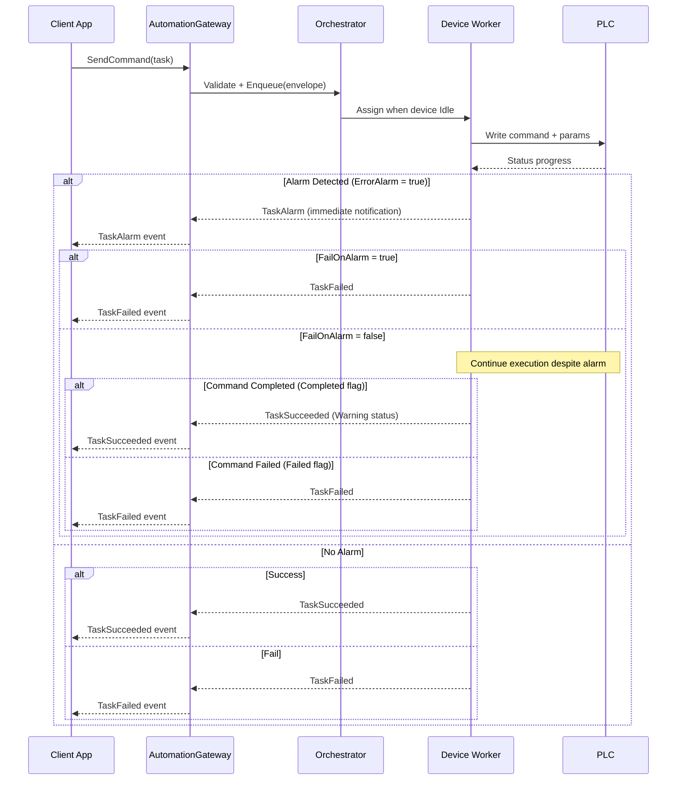
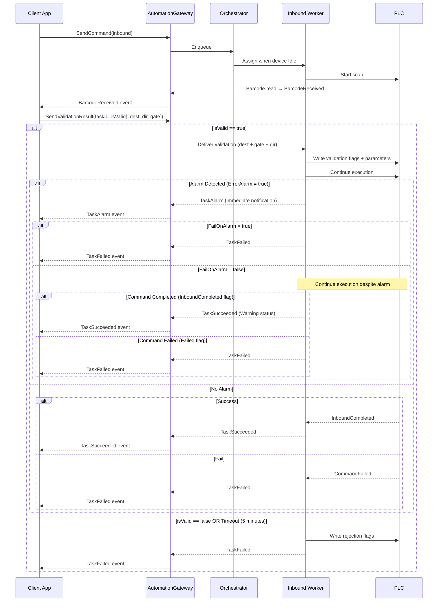
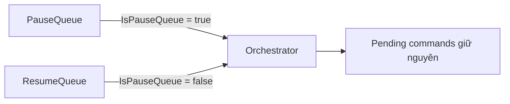
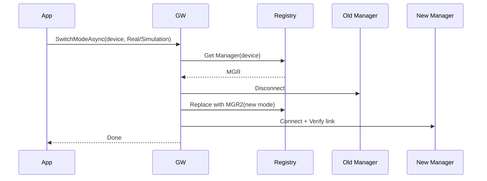

# 3. Luồng xử lý (Flows)

## 3.0 Alarm Handling - FailOnAlarm Configuration

SDK hỗ trợ hai chế độ xử lý alarm thông qua cấu hình `FailOnAlarm` trong `PlcConnectionOptions`:

### FailOnAlarm = true (Fail Fast Mode)
- ⚠️ **TaskAlarm event** được raise ngay khi phát hiện `ErrorAlarm = true`
- ❌ Task **fail ngay lập tức** sau khi raise alarm event
- ⛔ **Không chờ** PLC hoàn thành hoặc set `CommandFailed` flag
- 📋 **Use case**: Critical operations, safety-first scenarios

### FailOnAlarm = false (Continue Mode - Default)
- ⚠️ **TaskAlarm event** được raise ngay khi phát hiện `ErrorAlarm = true`
- ⏳ Task **tiếp tục thực thi** sau khi raise alarm event
- 🔄 Chờ PLC xử lý và kiểm tra flag `Completed` hoặc `CommandFailed`
- ✅ Nếu PLC set `Completed` flag → **TaskSucceeded** với Warning status
- ❌ Nếu PLC set `CommandFailed` flag → **TaskFailed**
- 📋 **Use case**: Non-critical operations, allow PLC to recover

**Lưu ý:** 
- TaskAlarm luôn được raise **trước** TaskSucceeded/TaskFailed
- Alarm notification chỉ raise **một lần** để tránh duplicate
- CheckPallet command luôn fail khi có alarm (bỏ qua FailOnAlarm setting)

## 3.1 Outbound/Transfer – Tổng quát

## 3.2 Inbound với Barcode Validation

## 3.3 Pause/Resume Queue

## 3.4 SwitchMode Runtime

