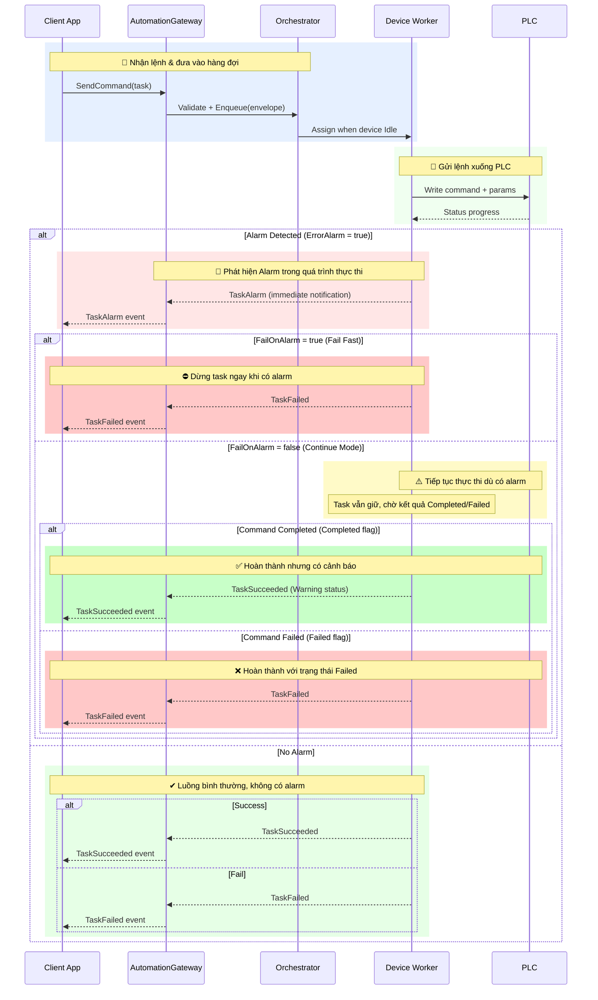
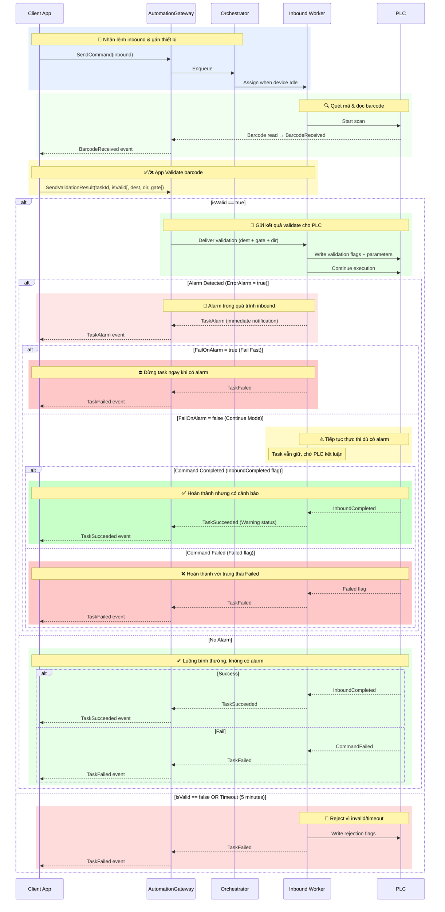
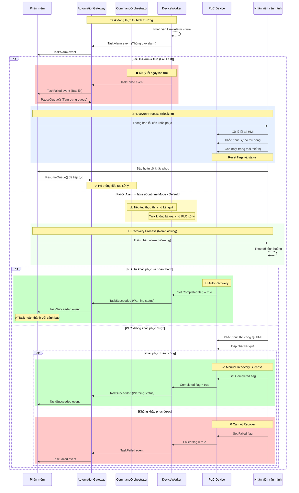
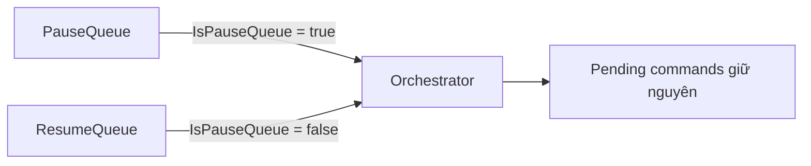

# 3. Luồng xử lý (Flows)

## 3.0 Alarm Handling - FailOnAlarm Configuration

SDK hỗ trợ hai chế độ xử lý alarm thông qua cấu hình `FailOnAlarm` trong `PlcConnectionOptions`:

### FailOnAlarm = true (Fail Fast Mode)
- ⚠️ **TaskAlarm event** được raise ngay khi phát hiện `ErrorAlarm = true`
- ❌ Task **fail ngay lập tức** sau khi raise alarm event
- ⛔ **Không chờ** PLC hoàn thành hoặc set `CommandFailed` flag
- 📋 **Use case**: Critical operations, safety-first scenarios

### FailOnAlarm = false (Continue Mode - Default)
- ⚠️ **TaskAlarm event** được raise ngay khi phát hiện `ErrorAlarm = true`
- ⏳ Task **tiếp tục thực thi** sau khi raise alarm event
- 🔄 Chờ PLC xử lý và kiểm tra flag `Completed` hoặc `CommandFailed`
- ✅ Nếu PLC set `Completed` flag → **TaskSucceeded** với Warning status
- ❌ Nếu PLC set `CommandFailed` flag → **TaskFailed**
- 📋 **Use case**: Non-critical operations, allow PLC to recover

**Lưu ý:** 
- TaskAlarm luôn được raise **trước** TaskSucceeded/TaskFailed
- Alarm notification chỉ raise **một lần** để tránh duplicate
- CheckPallet command luôn fail khi có alarm (bỏ qua FailOnAlarm setting)

## 3.1 Outbound/Transfer – Tổng quát

## 3.2 Inbound với Barcode Validation

## 3.3 Error Recovery & Alarm Handling

Khi phát hiện alarm (`ErrorAlarm = true`) trong quá trình thực thi, hệ thống xử lý theo flow sau:

### 3.3.1 Recovery Flow - FailOnAlarm = false (Continue Mode)

### 3.3.2 Workflow Chi Tiết

#### Khi FailOnAlarm = true:

1. **Phát hiện Alarm**:
   - `DeviceWorker` phát hiện `ErrorAlarm = true` khi polling PLC
   - Raise `TaskAlarm` event ngay lập tức qua `AutomationGateway`
   - **Dừng ngay** và raise `TaskFailed` event

2. **Recovery Actions**:
   - Application nhận `TaskFailed` event
   - App có thể gọi `PauseQueue()` để tạm dừng xử lý các task khác
   - Thông báo lỗi cho nhân viên vận hành

3. **Manual Intervention**:
   - Nhân viên vận hành khắc phục sự cố tại HMI
   - Cập nhật trạng thái thiết bị và reset các flags trên PLC
   - Xác nhận thiết bị đã sẵn sàng

4. **Resume**:
   - App gọi `ResumeQueue()` để tiếp tục xử lý
   - `CommandOrchestrator` và `Matchmaker` tiếp tục matching tasks

#### Khi FailOnAlarm = false (Continue Mode - Default):

1. **Phát hiện Alarm**:
   - `DeviceWorker` phát hiện `ErrorAlarm = true`
   - Raise `TaskAlarm` event (thông báo warning)
   - **Tiếp tục chờ** kết quả từ PLC (không dừng task)

2. **Parallel Recovery**:
   - Task vẫn tiếp tục thực thi trong `DeviceWorker`
   - Application nhận warning và có thể thông báo nhân viên
   - PLC có thể tự khắc phục hoặc cần can thiệp

3. **Outcome Scenarios**:
   
   **a) PLC tự recovery thành công:**
   - PLC tự động xử lý và set `Completed = true`
   - `DeviceWorker` nhận được và raise `TaskSucceeded` với `Warning` status
   - Task hoàn thành bình thường, `ReplyHub` broadcast kết quả
   
   **b) Cần can thiệp thủ công:**
   - Nhân viên khắc phục tại HMI
   - Cập nhật cờ `Completed` hoặc `Failed` trên PLC
   - `DeviceWorker` polling và nhận kết quả, raise event tương ứng

### 3.3.3 So Sánh Hai Chế Độ

| Tiêu chí | FailOnAlarm = true | FailOnAlarm = false |
|----------|-------------------|---------------------|
| **Phản ứng** | Fail ngay lập tức | Tiếp tục chờ kết quả |
| **Queue** | Pause tự động | Không ảnh hưởng |
| **Recovery** | Blocking (phải xử lý xong mới tiếp tục) | Non-blocking (parallel) |
| **Use Case** | Critical operations, safety-first | Non-critical, cho phép retry |
| **Task Status** | Failed immediately | Succeeded (Warning) hoặc Failed |
| **Manual Intervention** | Bắt buộc trước khi resume | Optional, chỉ khi PLC không tự recovery |

### 3.3.4 Best Practices

**Khuyến nghị sử dụng FailOnAlarm = true khi:**
- ✅ Operations ảnh hưởng an toàn
- ✅ Không thể chấp nhận lỗi (critical path)
- ✅ Cần can thiệp ngay lập tức

**Khuyến nghị sử dụng FailOnAlarm = false khi:**
- ✅ Operations có thể retry/recovery
- ✅ PLC có khả năng tự khắc phục
- ✅ Không muốn block toàn bộ queue
- ✅ Ví dụ: Transfer tasks, Outbound operations

**Lưu ý đặc biệt:**
- 🔔 `TaskAlarm` event **luôn được raise** trong cả hai mode
- ⚠️ Alarm chỉ notify **một lần** để tránh spam

---

## 3.4 Pause/Resume Queue

## 3.5 Device Recovery Flow
