# 3. Luồng xử lý (Flows)

## 3.0 Alarm Handling - FailOnAlarm Configuration

SDK hỗ trợ hai chế độ xử lý alarm thông qua cấu hình `FailOnAlarm` trong `PlcConnectionOptions`:

### FailOnAlarm = true (Fail Fast Mode)
- ⚠️ **TaskAlarm event** được raise ngay khi phát hiện `ErrorAlarm = true`
- ❌ Task **fail ngay lập tức** sau khi raise alarm event
- ⛔ **Không chờ** PLC hoàn thành hoặc set `CommandFailed` flag
- 📋 **Use case**: Critical operations, safety-first scenarios

### FailOnAlarm = false (Continue Mode - Default)
- ⚠️ **TaskAlarm event** được raise ngay khi phát hiện `ErrorAlarm = true`
- ⏳ Task **tiếp tục thực thi** sau khi raise alarm event
- 🔄 Chờ PLC xử lý và kiểm tra flag `Completed` hoặc `CommandFailed`
- ✅ Nếu PLC set `Completed` flag → **TaskSucceeded** với Warning status
- ❌ Nếu PLC set `CommandFailed` flag → **TaskFailed**
- 📋 **Use case**: Non-critical operations, allow PLC to recover

**Lưu ý:** 
- TaskAlarm luôn được raise **trước** TaskSucceeded/TaskFailed
- Alarm notification chỉ raise **một lần** để tránh duplicate
- CheckPallet command luôn fail khi có alarm (bỏ qua FailOnAlarm setting)

## 3.1 Outbound/Transfer – Tổng quát

## 3.2 Inbound với Barcode Validation

## 3.3 Error Recovery & Alarm Handling

Khi phát hiện alarm (`ErrorAlarm = true`) trong quá trình thực thi, hệ thống xử lý theo flow sau:

### 3.3.1 Recovery Flow - FailOnAlarm = false (Continue Mode)

```mermaid
sequenceDiagram
    participant App as Phần mềm
    participant GW as AutomationGateway
    participant ORC as CommandOrchestrator
    participant Worker as DeviceWorker
    participant PLC as PLC Device
    participant HMI as Nhân viên vận hành
    
    Note over GW,Worker: Task đang thực thi bình thường
    
    Worker->>Worker: Phát hiện ErrorAlarm = true
    Worker->>GW: TaskAlarm event (Thông báo alarm)
    GW->>App: TaskAlarm event
    
    alt FailOnAlarm = true (Fail Fast)
        Note over Worker,ORC: Xử lý lỗi ngay lập tức
        Worker->>GW: TaskFailed event
        GW->>App: TaskFailed event (Báo lỗi)
        App->>GW: PauseQueue() (Tạm dừng queue)

        Note over App,HMI: Recovery Process (Blocking)
        App->>HMI: Thông báo lỗi cần khắc phục
        HMI->>PLC: Xử lý lỗi tại HMI
        HMI->>PLC: Khắc phục sự cố thủ công
        HMI->>PLC: Cập nhật trạng thái thiết bị
        Note over HMI,PLC: Reset flags và status
        
        HMI->>App: Báo hoàn tất khắc phục
        App->>GW: ResumeQueue()
        Note over GW,ORC: Hệ thống tiếp tục xử lý
        
    else FailOnAlarm = false (Continue Mode - Default)
        Note over Worker,ORC: Tiếp tục thực thi, chờ kết quả
        Note over Worker: Task không bị xóa, chờ PLC xử lý
        
        Note over App,HMI: Recovery Process (Non-blocking)
        App->>HMI: Thông báo alarm (Warning)
        HMI->>HMI: Theo dõi tình huống
        
        alt PLC tự khắc phục và hoàn thành
            Note over PLC: Auto Recovery
            PLC->>Worker: Set Completed flag = true
            Worker->>GW: TaskSucceeded (Warning status)
            GW->>App: TaskSucceeded event
            Note over App: Task hoàn thành với cảnh báo
            
        else PLC không khắc phục được
            HMI->>PLC: Khắc phục thủ công tại HMI
            HMI->>PLC: Cập nhật kết quả
            
            alt Khắc phục thành công
                Note over HMI,PLC: Manual Recovery Success
                HMI->>PLC: Set Completed flag
                PLC->>Worker: Completed flag = true
                Worker->>GW: TaskSucceeded (Warning status)
                GW->>App: TaskSucceeded event
                
            else Không khắc phục được
                Note over HMI,PLC: Cannot Recover
                HMI->>PLC: Set Failed flag
                PLC->>Worker: Failed flag = true
                Worker->>GW: TaskFailed event
                GW->>App: TaskFailed event
            end
        end
    end

```

### 3.3.2 Workflow Chi Tiết

#### Khi FailOnAlarm = true:

1. **Phát hiện Alarm**:
   - `DeviceWorker` phát hiện `ErrorAlarm = true` khi polling PLC
   - Raise `TaskAlarm` event ngay lập tức qua `AutomationGateway`
   - **Dừng ngay** và raise `TaskFailed` event

2. **Recovery Actions**:
   - Application nhận `TaskFailed` event
   - App có thể gọi `PauseQueue()` để tạm dừng xử lý các task khác
   - Thông báo lỗi cho nhân viên vận hành

3. **Manual Intervention**:
   - Nhân viên vận hành khắc phục sự cố tại HMI
   - Cập nhật trạng thái thiết bị và reset các flags trên PLC
   - Xác nhận thiết bị đã sẵn sàng

4. **Resume**:
   - App gọi `ResumeQueue()` để tiếp tục xử lý
   - `CommandOrchestrator` và `Matchmaker` tiếp tục matching tasks

#### Khi FailOnAlarm = false (Continue Mode - Default):

1. **Phát hiện Alarm**:
   - `DeviceWorker` phát hiện `ErrorAlarm = true`
   - Raise `TaskAlarm` event (thông báo warning)
   - **Tiếp tục chờ** kết quả từ PLC (không dừng task)

2. **Parallel Recovery**:
   - Task vẫn tiếp tục thực thi trong `DeviceWorker`
   - Application nhận warning và có thể thông báo nhân viên
   - PLC có thể tự khắc phục hoặc cần can thiệp

3. **Outcome Scenarios**:
   
   **a) PLC tự recovery thành công:**
   - PLC tự động xử lý và set `Completed = true`
   - `DeviceWorker` nhận được và raise `TaskSucceeded` với `Warning` status
   - Task hoàn thành bình thường, `ReplyHub` broadcast kết quả
   
   **b) Cần can thiệp thủ công:**
   - Nhân viên khắc phục tại HMI
   - Cập nhật cờ `Completed` hoặc `Failed` trên PLC
   - `DeviceWorker` polling và nhận kết quả, raise event tương ứng

### 3.3.3 So Sánh Hai Chế Độ

| Tiêu chí | FailOnAlarm = true | FailOnAlarm = false |
|----------|-------------------|---------------------|
| **Phản ứng** | Fail ngay lập tức | Tiếp tục chờ kết quả |
| **Queue** | Pause tự động | Không ảnh hưởng |
| **Recovery** | Blocking (phải xử lý xong mới tiếp tục) | Non-blocking (parallel) |
| **Use Case** | Critical operations, safety-first | Non-critical, cho phép retry |
| **Task Status** | Failed immediately | Succeeded (Warning) hoặc Failed |
| **Manual Intervention** | Bắt buộc trước khi resume | Optional, chỉ khi PLC không tự recovery |

### 3.3.4 Best Practices

**Khuyến nghị sử dụng FailOnAlarm = true khi:**
- ✅ Operations ảnh hưởng an toàn
- ✅ Không thể chấp nhận lỗi (critical path)
- ✅ Cần can thiệp ngay lập tức

**Khuyến nghị sử dụng FailOnAlarm = false khi:**
- ✅ Operations có thể retry/recovery
- ✅ PLC có khả năng tự khắc phục
- ✅ Không muốn block toàn bộ queue
- ✅ Ví dụ: Transfer tasks, Outbound operations

**Lưu ý đặc biệt:**
- 🔔 `TaskAlarm` event **luôn được raise** trong cả hai mode
- ⚠️ Alarm chỉ notify **một lần** để tránh spam

---

## 3.4 Pause/Resume Queue

## 3.5 SwitchMode Runtime

